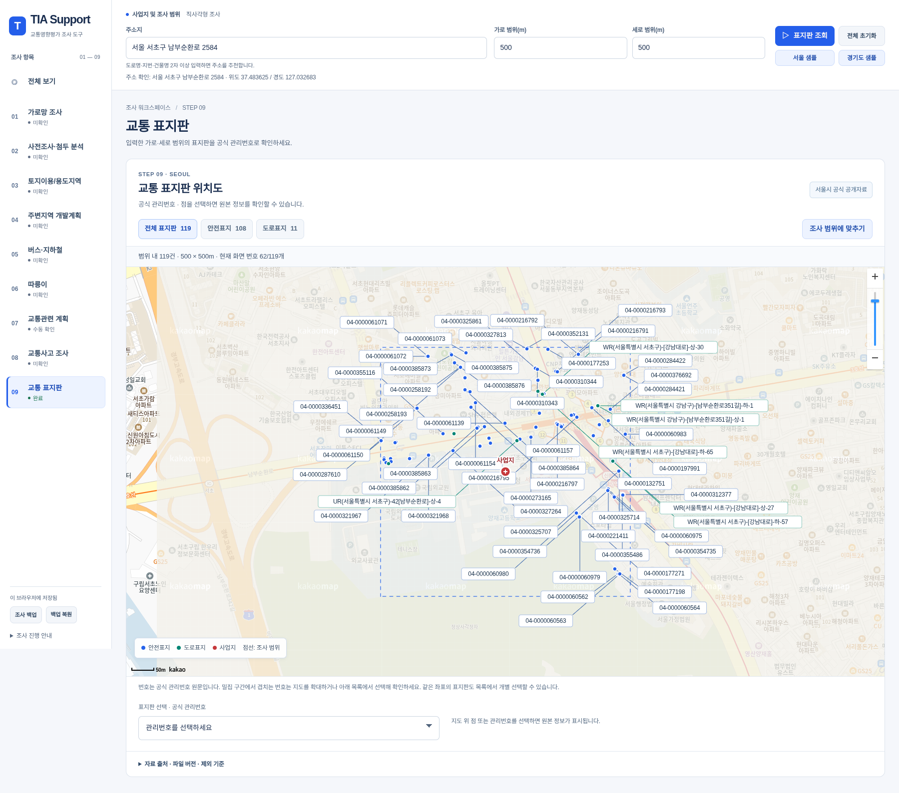

# STEP 9 검증 기록

2026-10-08, `feat/step9-seoul-sign-map` 구현 확인.

- `npm run build`: ESLint, 단위 테스트 241개, Next.js 프로덕션 빌드 통과.
- `scripts/check_workspace_ui.mjs`: 기존 STEP 1~8 전환, 지도 DOM 유지/분할/전체화면, 도로 편집, XLSX 4시트 출력, 백업·복원·재접속 저장, 7개 화면 너비, 모바일 embed, 별도 계산기 로그인 검증 통과.
- `scripts/check_step9_ui.mjs`: 실제 주소 검색, 카카오 지도 타일, 공식 관리번호, 안전표지/도로표지 필터, 점 선택, STEP 5/전체 보기에서 표지판 숨김과 추가 요청 없음, STEP 9 재진입, 잘못된 범위에서 이전 결과 제거, 모바일 가로 넘침 없음, 기본 범위 3,735개 점 표시 검증 통과. 브라우저 오류와 HTTP 실패 없음.
- 빌드된 API: 좌표 누락/문자열, 범위 0은 400 응답. 정상 조회는 200. 서버 배포 추적 파일에 스냅샷과 manifest 포함 확인.

실제 검색: **서울 서초구 남부순환로 2584**, 주소 검색 결과 위도 37.483625 / 경도 127.032683.

| 범위 | 안전표지 | 도로표지 | 합계 |
|---|---:|---:|---:|
| 500 × 500m (아래 예시) | 108 | 11 | 119 |
| 2,300 × 3,200m (기존 기본 범위) | 3,489 | 246 | 3,735 |

개수는 공식 공개자료 레코드 기준이다. 겹치는 번호를 모두 억지로 배치하지 않는다. 예시의 119개 점 중 현재 화면에 배치 가능한 관리번호 62개를 표시하며, 표시 수를 화면에 안내한다. 확대하거나 목록에서 선택하면 개별 번호와 원본 정보를 확인할 수 있다. 같은 좌표의 서로 다른 관리번호도 보존한다.

예시 이미지는 디자인 목업이 아닌 로컬 프로덕션 빌드의 실제 브라우저 화면이다. 환경에 서버 지도 키가 없어 운영 페이지에서 공개된 브라우저용 지도 설정을 로컬 빌드에 사용했다. 카카오 허용 도메인 제약을 충족하도록 격리된 브라우저에서 운영 도메인의 페이지/정적 자산/표지판 API 요청을 로컬 서버로 연결했다. 주소 검색과 지도 SDK·타일은 실제 운영/공식 응답이다. 운영 사이트 코드를 배포하거나 운영 데이터를 수정하지 않았다. 키는 저장소와 이 문서에 포함하지 않는다.

```sh
node scripts/check_step9_ui.mjs http://127.0.0.1:3012 --production-origin
```



STEP 10 연구는 `traffic-facilities-step10-research.md`에 보관했으며 STEP 10 기능은 추가하지 않았다.
